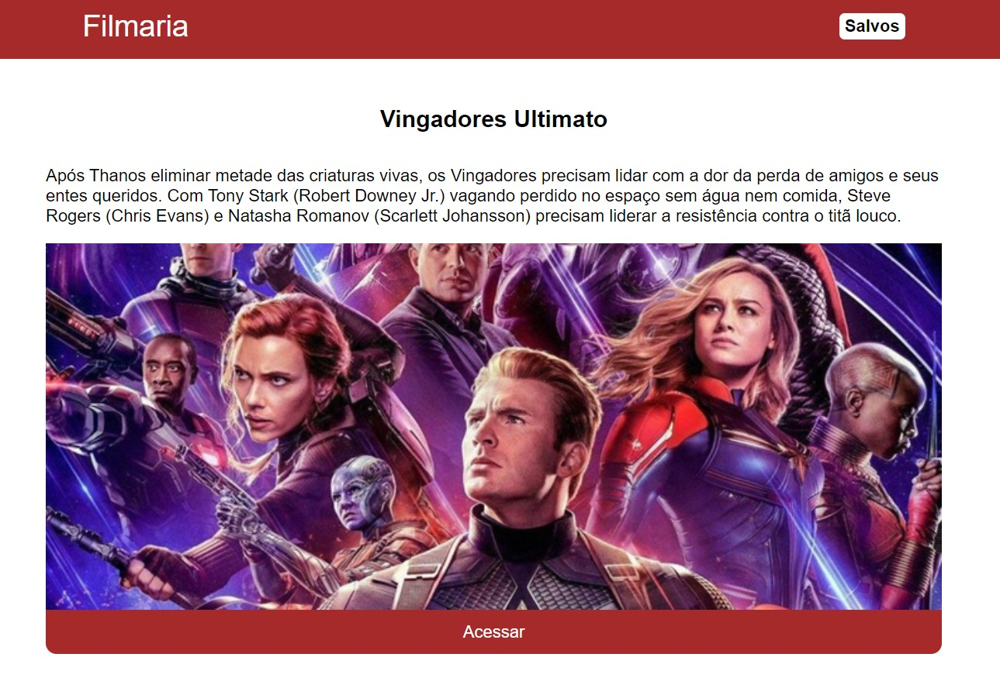
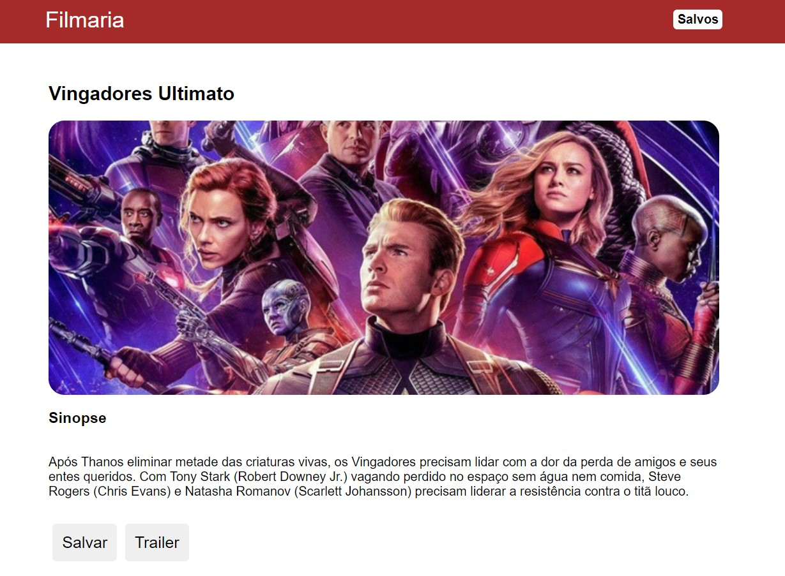
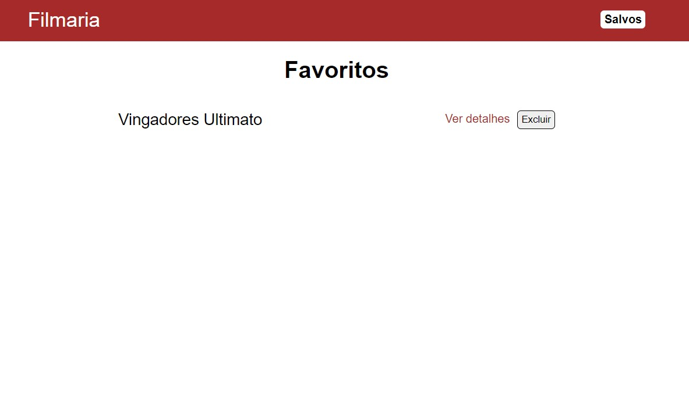

# Filmaria

Aplicação desenvolvida durante o curso de React.abs

https://filmaria-rct.netlify.app/

## Páginas

### Início

Nesta página você encontrará os filmes lançados, suas sinopses e conseguirá ver os detalhes desses títulos selecionando o botão "Acessar" abaixo do banner.

   
  Imagem 01: página "Início".

### Detalhes

Aqui você encontrará o título, sinopse e poderá abrir o trailer do vídeo em outra aba no Youtube selecionado o botão "Trailer" na parte inferior da página. Além disso, é possível salvar o filme na página "Salvos" utilizando o botão "Salvar" abaixo da sinopse.

   
  Imagem 02: página "Detalhes".

### Salvos

Nesta página você encontrará os filmes que você salvou na página "Detalhes". 

Para ver mais detalhes do título selecione a opção "Ver detalhes" que o direcionará para a página "Detalhes" ou selecione a opção "Excluir" para tirar o título da sua lista de filmes salvos. 

   
  Imagem 03: página "Salvos".

## Tecnologias utilizadas

- [x] React;
- [x] React Components
- [x] API REST.
- [x] Axios.

## Desenvolvimento

<table>
  <tr>
    <td border="1px solid #ddd" align="center">
      <a href="https://github.com/wesleysantossts">
        
         
        Wesley Santos
      </a>
    </td>
  </tr>
</table>